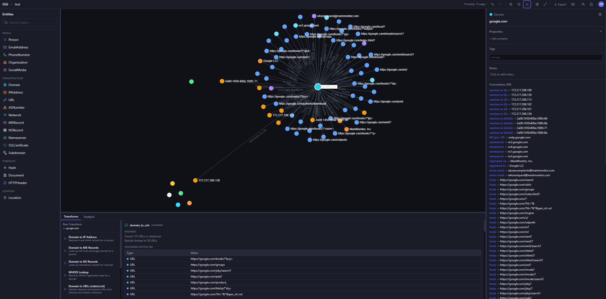
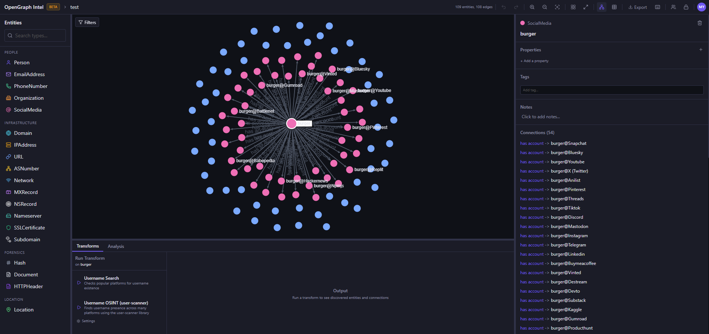
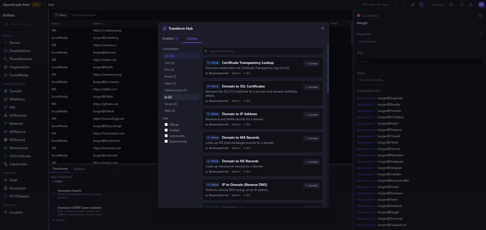
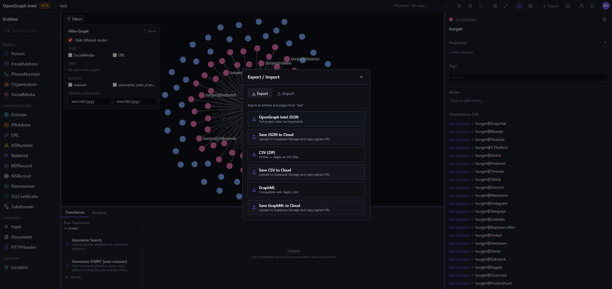

<div align="center">


# OpenGraph Intel (OGI)

**Open-source visual link analysis and OSINT framework.**
**Free, self-hostable, and community-driven.**

[](https://www.gnu.org/licenses/agpl-3.0)
[](https://github.com/khashashin/ogi/actions/workflows/ci.yml)
[](https://github.com/khashashin/ogi/actions/workflows/docker-publish.yml)
[](https://www.python.org)
[](https://www.typescriptlang.org)
[](https://react.dev)
[](https://fastapi.tiangolo.com)


[Features](#features) &bull; [Screenshots](#screenshots) &bull; [Quick Start](#quick-start) &bull; [Docker](#docker) &bull; [Transform Hub](#transform-hub) &bull; [Architecture](#architecture) &bull; [Contributing](#contributing)

</div>

---

> **Heads up:** This project is actively evolving. It has solid core capabilities and test coverage, and we continue to improve documentation, hardening, and feature depth with each release. Contributions, bug reports, and feedback are very welcome.

## Features

- **Visual graph investigation** — drag-and-drop entities, explore connections interactively
- **20+ built-in transforms** — DNS, WHOIS, SSL certs, geolocation, web/email/hash/social enrichment, and more
- **Transform Hub** — browse and install community transforms from the [registry](https://github.com/opengraphintel/ogi-transforms)
- **Import / Export** — JSON, CSV, GraphML, and MTGX format import
- **Graph analysis** — centrality, community detection, shortest paths
- **Real-time collaboration** — projects, sharing, and live sync via Supabase Realtime
- **Async transform jobs** — Redis/RQ queue with WebSocket progress updates
- **Plugin system** — directory-based plugin discovery with YAML manifests
- **CLI tool** — search, install, and manage transforms from the terminal
- **Runs anywhere** — local SQLite mode (zero config) or PostgreSQL + Supabase for team/cloud setups
- **Docker ready** — one-command deployment with `docker compose up`

## Screenshots

<div align="center">

|              Graph Investigation              |              Entity Enrichment              |
| :-------------------------------------------: | :-----------------------------------------: |
|  |  |

|              Transform Hub              |             Export / Import             |
| :-------------------------------------: | :-------------------------------------: |
|  |  |

</div>

## Quick Start

### Prerequisites

| Tool                             | Version |
| -------------------------------- | ------- |
| [Python](https://www.python.org) | 3.14+   |
| [uv](https://docs.astral.sh/uv/) | latest  |
| [Node.js](https://nodejs.org)    | 20+     |
| [pnpm](https://pnpm.io)          | latest  |

### Backend

```bash
cd backend
uv sync
uv run uvicorn ogi.main:app --reload
```

The API will be available at `http://localhost:8000`.

If you run the backend against PostgreSQL (`OGI_USE_SQLITE=false`), startup will automatically apply Alembic migrations before serving requests. Docker deployments do the same in the backend container entrypoint.

### Frontend

```bash
cd frontend
pnpm install
pnpm dev
```

Open http://localhost:5173. That's it.

### CLI

Two supported ways to run the CLI:

**Recommended** (no activation required):

```bash
cd backend
uv sync
uv run ogi --help
```

**Activated virtualenv** (plain `ogi` command):

```bash
cd backend
uv venv
# PowerShell:
.\.venv\Scripts\Activate.ps1
uv pip install -e .
ogi --help
```

## Docker

### Development

```bash
cp .env.example .env
docker compose up
```

### Production

Use the prebuilt GHCR images:

```bash
docker compose -f docker-compose.prod.yml pull
docker compose -f docker-compose.prod.yml up -d
```

Set `OGI_IMAGE_TAG` in `.env` to pin a specific release image tag (e.g. `v0.2.6`). Defaults to `latest`.

<details>
<summary><strong>Services overview</strong></summary>

| Service    | Description                | Port |
| ---------- | -------------------------- | ---- |
| `backend`  | FastAPI application server | 8000 |
| `worker`   | RQ async job worker        | -    |
| `frontend` | React app served via nginx | 80   |
| `db`       | PostgreSQL 16              | 5432 |
| `redis`    | Redis 7 (job queue)        | 6379 |

</details>

---

<details>
<summary><strong>Boot-time plugin dependencies</strong></summary>

If you use prebuilt images and a plugin needs extra Python libraries, OGI installs plugin dependencies at container startup from:

1. `plugins/requirements.txt` (preferred), or
2. auto-generated requirements derived from `plugins/ogi-lock.json` when `requirements.txt` is missing.

**Environment variables:**

| Variable                       | Default                         | Description                          |
| ------------------------------ | ------------------------------- | ------------------------------------ |
| `OGI_BOOT_REQUIREMENTS_ENABLE` | `true`                          | Enable/disable boot-time install     |
| `OGI_BOOT_REQUIREMENTS_FILE`   | `/app/plugins/requirements.txt` | Path to requirements file            |
| `OGI_BOOT_LOCK_FILE`           | `/app/plugins/ogi-lock.json`    | Path to lock file                    |
| `OGI_BOOT_REQUIREMENTS_STRICT` | `false`                         | Fail startup if requirements missing |

</details>

---

## Transform Hub

OpenGraph Intel has a built-in transform marketplace. Browse, install, and manage transforms from the [community registry](https://github.com/opengraphintel/ogi-transforms).

> **Security note:** Plugins that require API keys should be treated as privileged code. If a plugin can access your secrets and make outbound network requests, it can misuse or exfiltrate those secrets. Review trust tier, permissions, and required services before installing or running third-party plugins.

```bash
# Search for transforms
uv run ogi transform search dns

# Install a transform
uv run ogi transform install shodan-host-lookup
```

### Built-in Transform Categories

| Category     | Examples                              |
| ------------ | ------------------------------------- |
| DNS          | A, AAAA, MX, NS, CNAME records        |
| IP & ASN     | GeoIP, reverse IP, ASN info           |
| SSL/TLS      | Certificate transparency, SSL labs    |
| Email        | Mailserver validation, breach checks  |
| Web          | WHOIS, domain info, web extraction    |
| Social       | Username enumeration, social profiles |
| Hash         | MD5, SHA1, SHA256 lookups             |
| Organization | Company data enrichment               |

### Supported Entity Types

`Person` &bull; `Domain` &bull; `IPAddress` &bull; `EmailAddress` &bull; `PhoneNumber` &bull; `Organization` &bull; `URL` &bull; `SocialMedia` &bull; `Hash` &bull; `Document` &bull; `Location` &bull; `ASNumber` &bull; `Network` &bull; `MXRecord` &bull; `NSRecord` &bull; `Nameserver` &bull; `SSLCertificate` &bull; `Subdomain` &bull; `HTTPHeader`

### Building Your Own Transforms

Want to build your own? See the [contributing guide](https://github.com/opengraphintel/ogi-transforms/blob/main/CONTRIBUTING.md).

If your transform needs external service credentials, declare them in `api_keys_required`. Do not store secrets in transform settings. OGI manages those under `API Keys`, and secret-using plugins are considered privileged code.

Each plugin is a directory with a `plugin.yaml` manifest:

```yaml
name: my-transform
version: "1.0.0"
display_name: My Transform
description: What it does
author: Your Name
license: MIT
category: dns
input_types: [Domain]
output_types: [IPAddress]
permissions:
  network: true
  filesystem: false
  subprocess: false
```

## Architecture

### Tech Stack

| Layer            | Technology                                                               |
| ---------------- | ------------------------------------------------------------------------ |
| Backend          | Python 3.14+, FastAPI, SQLModel, asyncpg / aiosqlite                     |
| Frontend         | React 19, TypeScript 5.9, Sigma.js (graphology), Zustand, Tailwind CSS 4 |
| Database         | PostgreSQL 16 (primary) / SQLite (local fallback)                        |
| Auth & Realtime  | Supabase Auth + JWT + Realtime (optional in local mode)                  |
| Job Queue        | Redis 7 + RQ (async transforms)                                          |
| Package Managers | uv (backend), pnpm (frontend)                                            |
| Deployment       | Docker, nginx, GHCR                                                      |

### Project Structure

```
ogi/
├── backend/
│   └── ogi/
│       ├── api/            # REST API routes
│       ├── cli/            # CLI tool (Typer)
│       ├── db/             # Database layer (asyncpg + aiosqlite)
│       ├── engine/         # Graph engine & transform engine
│       ├── models/         # SQLModel definitions
│       ├── store/          # Data stores
│       ├── transforms/     # Built-in transforms
│       │   ├── dns/        # DNS resolution transforms
│       │   ├── cert/       # SSL certificate transforms
│       │   ├── email/      # Email enrichment
│       │   ├── hash/       # Hash lookups
│       │   ├── ip/         # IP/ASN/geolocation
│       │   ├── org/        # Organization info
│       │   ├── social/     # Social media
│       │   └── web/        # Web scraping/extraction
│       ├── worker/         # Async job queue (RQ)
│       ├── config.py       # Pydantic settings
│       └── main.py         # FastAPI entry point
├── frontend/
│   └── src/
│       ├── api/            # API client
│       ├── components/     # React components
│       ├── hooks/          # Custom hooks (realtime sync, etc.)
│       ├── stores/         # Zustand state management
│       ├── types/          # TypeScript types
│       └── App.tsx         # Main application
├── plugins/                # Community plugins directory
├── docs/                   # Documentation & images
├── docker-compose.yml      # Development deployment
├── docker-compose.prod.yml # Production deployment
└── .env.example            # Environment template
```

### Configuration

OGI uses [pydantic-settings](https://docs.pydantic.dev/latest/concepts/pydantic_settings/) with `.env` file support. All variables are prefixed with `OGI_`.

<details>
<summary><strong>Key environment variables</strong></summary>

| Variable              | Description                               | Default                                      |
| --------------------- | ----------------------------------------- | -------------------------------------------- |
| `OGI_DATABASE_URL`    | PostgreSQL connection string              | `postgresql://postgres:postgres@db:5432/ogi` |
| `OGI_USE_SQLITE`      | Use SQLite instead of PostgreSQL          | `false`                                      |
| `OGI_DATABASE_PATH`   | SQLite database file path                 | `ogi.db`                                     |
| `OGI_PLUGIN_DIRS`     | Plugin search directories                 | `["plugins"]`                                |
| `OGI_CORS_ORIGINS`    | Allowed CORS origins                      | `["http://localhost:5173"]`                  |
| `SUPABASE_URL`        | Supabase project URL                      | -                                            |
| `SUPABASE_ANON_KEY`   | Supabase anon/public key                  | -                                            |
| `SUPABASE_JWT_SECRET` | JWT secret for auth (omit for local mode) | -                                            |

See [`.env.example`](.env.example) for the full list.

</details>

## Development

### Running Tests

```bash
# Backend
cd backend
OGI_DB_PATH=":memory:" OGI_USE_SQLITE=true uv run pytest

# Frontend
cd frontend
pnpm test
```

### Linting & Type Checking

```bash
# Backend
cd backend
uv run ruff check        # Linting
uv run mypy              # Type checking

# Frontend
cd frontend
pnpm lint                # ESLint
```

### CI Pipeline

The [CI workflow](.github/workflows/ci.yml) runs on every pull request:

- **Backend:** ruff lint, mypy type check, pytest
- **Frontend:** vitest, eslint, vite build

## Contributing

PRs welcome! If you find a bug or have an idea, [open an issue](https://github.com/khashashin/ogi/issues).

For new transforms, contribute to [ogi-transforms](https://github.com/opengraphintel/ogi-transforms).

### Getting Started

1. Fork the repository
2. Create a feature branch (`git checkout -b feature/my-feature`)
3. Make your changes
4. Run tests and linting
5. Submit a pull request

## Legal & Responsible Use

OGI is a general-purpose OSINT and graph analysis tool. **You are solely responsible for how you use it.** See [LEGAL.md](LEGAL.md) for the full legal notice.

- **Comply with third-party Terms of Service.** Transforms that query external services (DNS, WHOIS, web scraping, username lookups, etc.) must be used in accordance with the ToS of those services. Automated or bulk querying of sites that prohibit it may violate their terms.
- **Respect data protection law.** If you are in the EU or processing data about EU residents, GDPR applies to you as the data controller. Collecting, storing, or processing personal data (names, email addresses, IP addresses, etc.) requires a lawful basis. OGI itself does not store data beyond your local instance — you are responsible for what you collect and retain.
- **Use for lawful purposes only.** OGI is intended for legitimate security research, investigations, threat intelligence, and educational use. Do not use it to harass individuals, conduct unauthorized access, or violate applicable law.
- **File format compatibility.** OGI supports import of the MTGX graph exchange format. This is provided purely for data interoperability and does not imply any affiliation with or endorsement by the makers of tools that use this format.

> **Disclaimer:** OGI is provided "as is" without warranty of any kind. The authors are not liable for any misuse or damages arising from use of this software.

## License

This project is licensed under the [GNU Affero General Public License v3.0](LICENSE).

---

<div align="center">

**[Report Bug](https://github.com/khashashin/ogi/issues) &bull; [Request Feature](https://github.com/khashashin/ogi/issues) &bull; [Discussions](https://github.com/khashashin/ogi/discussions)**

Made with 💜 by the OGI community

</div>
