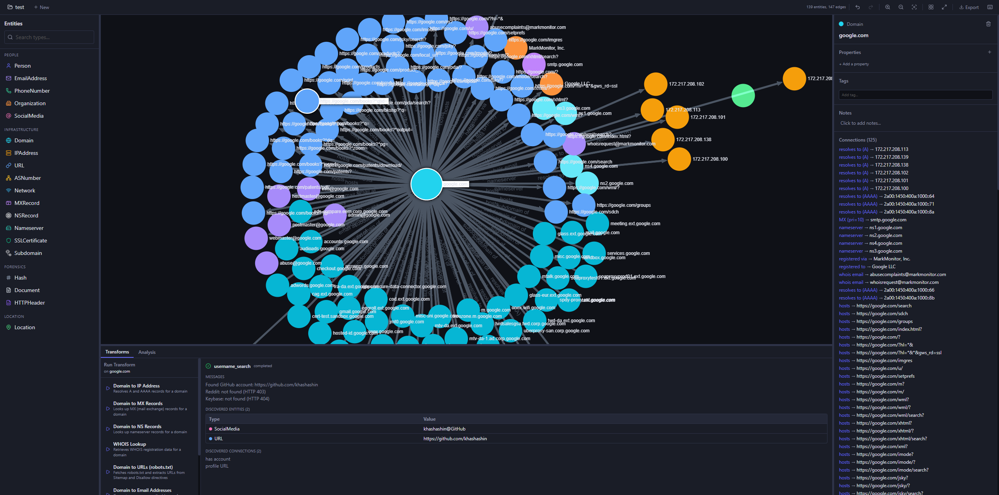

# OGI — OpenGraph Intel

An open source visual link analysis and OSINT framework. Think Maltego, but free and community-driven.



> **Heads up:** This project was largely vibe-coded — built fast with AI assistance to explore what's possible. It works, it's fun to use, but it's rough around the edges. Documentation is thin, there are likely security issues, and it is **not recommended for production use**. Contributions, bug reports, and feedback are very welcome.

## What it does

- **Visual graph investigation** — drag-and-drop entities, explore connections
- **15 built-in transforms** — DNS, WHOIS, SSL certs, geolocation, certificate transparency, and more
- **Transform Hub** — browse and install community transforms from the [registry](https://github.com/opengraphintel/ogi-transforms)
- **Import/Export** — JSON, CSV, GraphML
- **Graph analysis** — centrality, community detection, shortest paths
- **Collaboration** — projects, sharing, real-time sync (via Supabase)
- **Runs anywhere** — local SQLite mode (zero config) or PostgreSQL + Supabase for teams

## Quick Start

### Backend

```bash
cd backend
uv sync
uv run uvicorn ogi.main:app --reload
```

### Frontend

```bash
cd frontend
pnpm install
pnpm dev
```

Open http://localhost:5173. That's it.

### Docker

```bash
docker compose up
```

## Tech Stack

| Layer | Tech |
|-------|------|
| Backend | Python, FastAPI, SQLModel, asyncpg/aiosqlite |
| Frontend | React, TypeScript, Sigma.js (graphology), Zustand, Tailwind CSS |
| Auth & Realtime | Supabase (optional — works without it) |
| Package managers | uv (backend), pnpm (frontend) |

## Transform Hub

OGI has a built-in transform marketplace. Browse, install, and manage transforms from the [community registry](https://github.com/opengraphintel/ogi-transforms).

```bash
ogi transform search dns
ogi transform install shodan-host-lookup
```

Want to build your own? See the [contributing guide](https://github.com/opengraphintel/ogi-transforms/blob/main/CONTRIBUTING.md).

## Project Status

This is an early-stage project. Here's what exists:

- Graph engine, entity registry, undo/redo
- 15 transforms across DNS, email, web, IP, certs, social, and hash categories
- Full REST API with project management
- Plugin system with v2 manifest spec
- CLI tool (`ogi transform ...`)
- Docker deployment
- Auth and real-time collaboration (Supabase)

What's missing or incomplete:

- Tests cover the basics but not edge cases
- No formal security audit
- Limited error handling in some transforms
- Desktop app (Tauri) is planned but not started

## Contributing

PRs welcome. If you find a bug or have an idea, open an issue.

For new transforms, contribute to [ogi-transforms](https://github.com/opengraphintel/ogi-transforms).

## License

[AGPLv3](LICENSE)
